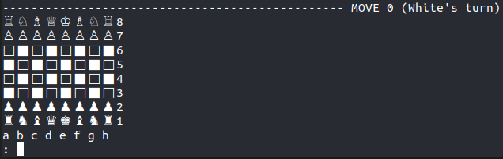

# Chesslib
For a mini code jam I decided to make a C++ representation of a chess board. I wrote it in about 8 hours. Most standard chess restrictions are not implemented, just like on a regular 'analog' board.
If you want to move your pawn to like a rook, you can. _Disclaimer: am not responsible for pissing off your opponent._

Special moves like castling, promoting and en pessant are possible (see below).
The program prints every state to stdout after every move, and reads moves for both White and Black in stdin.



### input
#### moving
To move a piece, type the coordinate of the piece you want to move, then the coordinate of the coordinate you want it to move to.
For example, to move a piece from e2 to e4:
```
e2 e4
```

#### castling
To castle kingside:
```
O-O
```

To castle queenside:
```
O-O-O
```

#### promoting
To promote, you can simply enter the piece to promote to after your move.
Below are the inputs for every piece:
   * Queen:    Q
   * Rook:     R
   * Knight:   K
   * Bishop:   B

For example:
```
    g7 g8 Q
```
promotes your pawn to a queen.

#### other
You can undo by giving 'z' as input, and quit by giving 'q' as input.